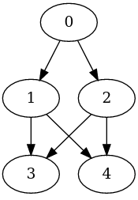

A model to minimize the makespan of the taskset, with precedence constraints modeled as a DAG, and map these tasks onto a heterogeneous set of cores. A deadline D is checked.

This example pinpoints where the optimization effort should focus to meet the deadline, in this case, `j0` in `c1`. If the duration for this job remained in its original value, i.e. 7, than the optimizer shows the message `=====UNSATISFIABLE=====`.


```
$ source ./env/bin/activate
$ python main.py model.mzn simple.dzn
MODEL: model.mzn
DATA: simple.dzn
N_JOBS: 5
N_CORES: 2
JSON output:
{
  "s" : [[10, 0], [3, 7], [0, 6], [9, 10], [8, 8]],
  "sel" : [[0, 1], [0, 1], [0, 1], [1, 0], [1, 0]],
  "end" : 10,
  "used" : [[0, 6], [7, 1], [6, 1], [9, 1], [8, 1]]
}

Makespan: 10
```


