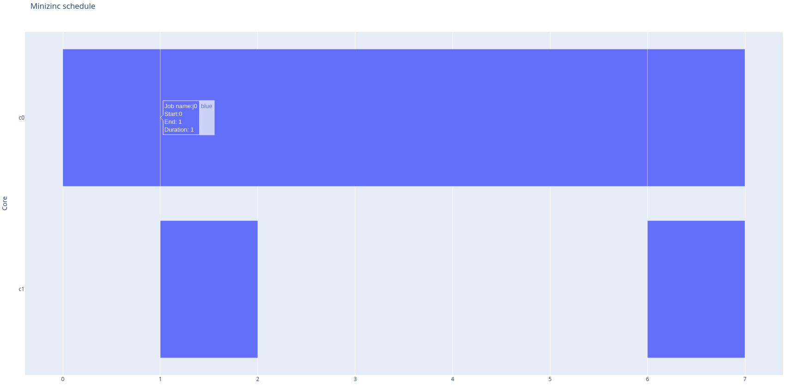

A model to minimize the makespan of the taskset, this time with predence constraints modeled as a DAG, and map these tasks onto a heterogeneous set of cores. 

```
$ source ./env/bin/activate
$ python main.py model.mzn simple.dzn
MODEL: model.mzn
DATA: simple.dzn
JSON output:
{
  "s" : [[8, 0], [3, 12], [0, 11], [7, 9], [6, 7]],
  "sel" : [[0, 1], [1, 0], [1, 0], [1, 0], [1, 0]],
  "end" : 8
}

Makespan: 8
```


