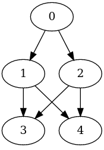

**TODO**

This model is built on top of the `affinity` model, but including **task period** and **processing unit utilization** constraint. Moreover, the variables are renamed for better readability of the models.

A model to minimize the power of the taskset, with precedence constraints modeled as a DAG, and map these tasks onto a heterogeneous set of cores. It includes deadline affinity constraints.

Note that `j0`, `c0` is chosen even considering that it is slower than `c1`. This is because `c0` is more energy efficient than `c1` and the deadline is still met.

```
$ source ./env/bin/activate
$ python main.py model.mzn simple.dzn
MODEL: model.mzn
DATA: simple.dzn
N_JOBS: 5
N_CORES: 2
JSON output:
{
  "s" : [[0, 11], [10, 0], [15, 10], [14, 2], [13, 0]],
  "sel" : [[1, 0], [1, 0], [0, 1], [1, 0], [1, 0]],
  "end" : 15,
  "total_energy" : 11,
  "used" : [[0, 10, 5], [10, 3, 3], [10, 1, 1], [14, 1, 1], [13, 1, 1]]
}

Makespan: 15
Total energy: 11
```


